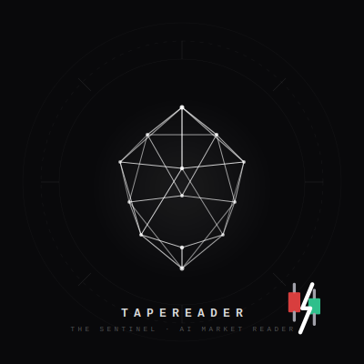

# TapeReader

> **AI-Powered Tape Reading untuk Scalper & Day Trader**  
> Cut the Noise. Trade the Signal.



---

## Apa itu TapeReader?

TapeReader adalah dashboard sentimen kilat yang dirancang khusus untuk **day trader dan scalper** di pasar saham Indonesia. Alih-alih membaca berita panjang secara manual sebelum market buka, pengguna cukup paste teks berita atau prospektus IPO — dan dalam hitungan detik, **The Sentinel** (AI engine berbasis Gemini 2.5 Pro) mengekstrak sinyal aksi langsung.

Output bukan narasi. Output adalah **data terstruktur siap pakai**:
- `catalyst_score` — Skor 1–100, dari Sangat Bearish ke Sangat Bullish
- `volatility_risk` — Level risiko: Rendah / Sedang / Tinggi / Ekstrem
- `key_drivers` — 3 kata kunci penggerak harga utama
- `action_signal` — Sinyal: Pantau Ketat / Berpotensi Naik / Waspada Koreksi

---

## Live Demo

| | |
|---|---|
| **Live App** | [tapereader.vercel.app](https://tapereader.vercel.app) |
| **Dashboard** | [tapereader.vercel.app/dashboard](https://tapereader.vercel.app/dashboard) |

---

## Tech Stack

| Layer | Teknologi |
|---|---|
| Framework | Next.js 15 (App Router) |
| Language | TypeScript |
| Styling | Tailwind CSS |
| Animation | Framer Motion |
| Icons | Lucide React |
| AI Engine | Google Gemini 2.5 Pro via `@google/genai` |
| Deployment | Vercel |

---

## Arsitektur

```
tapereader/
├── app/
│   ├── page.tsx                # Landing Page (Client Component)
│   ├── dashboard/
│   │   └── page.tsx            # Dashboard — 2-column terminal UI
│   └── actions/
│       └── gemini.ts           # Server Action — Gemini API integration
├── public/
│   └── sentinel-logo.svg       # The Sentinel character logo
└── README.md
```

### Alur Data

```
User pastes text
      │
      ▼
app/dashboard/page.tsx          (Client — validates, calls server action)
      │
      ▼
app/actions/gemini.ts           (Server Action — trim, clamp 5000 chars)
      │
      ▼
Gemini 2.5 Pro API              (responseMimeType: "application/json")
      │
      ▼
SentimentResponse { catalyst_score, volatility_risk, key_drivers, action_signal }
      │
      ▼
Dashboard renders result        (Framer Motion animations, dynamic color coding)
```

### Kenapa Server Action?

`app/actions/gemini.ts` dijalankan di server — artinya `GEMINI_API_KEY` **tidak pernah terekspos ke browser**. Ini pattern Next.js App Router yang aman dan tanpa perlu membuat API route terpisah.

---

## Instalasi Lokal

### Prerequisites
- Node.js ≥ 18
- Google Gemini API Key ([dapatkan di sini](https://aistudio.google.com/apikey))

### Steps

```bash
# 1. Clone repo
git clone https://github.com/YOUR_USERNAME/tapereader.git
cd tapereader

# 2. Install dependencies
npm install

# 3. Setup environment variable
cp .env.example .env.local
# Edit .env.local dan isi GEMINI_API_KEY

# 4. Jalankan dev server
npm run dev

# Buka http://localhost:3000
```

### Environment Variables

```env
# .env.local
GEMINI_API_KEY=your_gemini_api_key_here
```

---

## Deploy ke Vercel

```bash
# Install Vercel CLI
npm install -g vercel

# Deploy
vercel --prod
```

**Penting:** Tambahkan `GEMINI_API_KEY` di **Vercel Dashboard → Settings → Environment Variables** sebelum deploy.

---

## Keputusan Desain

### Visual Identity — "Industrial Terminal"

TapeReader dirancang dengan aesthetic **monochrome industrial terminal** — sepenuhnya hitam pekat (`#09090b`) dengan aksen emerald hanya pada elemen live/aktif, dan merah/hijau hanya pada sinyal trading.

Keputusan ini disengaja: trader tidak butuh UI yang indah, mereka butuh UI yang **tidak menyita atensi** dan membiarkan data berbicara.

| Elemen | Keputusan | Alasan |
|---|---|---|
| Font | `font-mono` (system) | Konsisten dengan aesthetic terminal, tidak perlu Google Fonts |
| Background | `#09090b` (zinc-950) | Lebih hitam dari pure black, mengurangi eye strain saat trading malam |
| Accent warna | Emerald untuk live, merah/kuning/hijau untuk sinyal | Mapping intuitif: hijau = naik, merah = turun |
| Animasi | Framer Motion, ease `[0.22, 1, 0.36, 1]` | Custom cubic bezier yang terasa "precision instrument" bukan playful |

### "The Sentinel" Character

Karakter AI TapeReader divisualisasikan sebagai **wireframe icosahedron** — bukan avatar humanoid. Ini disengaja:

- Icosahedron adalah bentuk geometris yang sempurna — melambangkan kalkulasi murni tanpa bias
- Wireframe tanpa fill = AI yang "melihat tembus" ke dalam data
- Rotasi 3D infinite = "selalu mengawasi pasar"
- Tidak ada wajah = tidak ada emosi, tidak ada opini — hanya sinyal

### AI Integration — Bukan Chatbot

Perbedaan utama TapeReader dari aplikasi AI generik: **output-nya adalah structured JSON**, bukan teks bebas. Gemini dipaksa menggunakan `responseMimeType: "application/json"` sehingga response selalu machine-parseable. Tidak ada hallucination format, tidak ada preamble.

---

## Validasi & Safety

```typescript
// app/actions/gemini.ts
const trimmed = text.trim();
if (!trimmed) throw new Error("Input tidak boleh kosong");
const safeText = trimmed.substring(0, 5000);  // Token limit guard

// Post-parse validation
parsed.catalyst_score = Math.min(100, Math.max(1, Math.round(parsed.catalyst_score)));
parsed.key_drivers = parsed.key_drivers.slice(0, 3);
```

---

## Disclaimer

> TapeReader adalah tool bantu analisis sentimen berbasis AI. Output bukan rekomendasi investasi. Selalu lakukan riset mandiri sebelum mengambil keputusan trading.

---

## License

MIT

---

*Built for WealthyPeople.id Stage 2 Developer Challenge — April 2026*